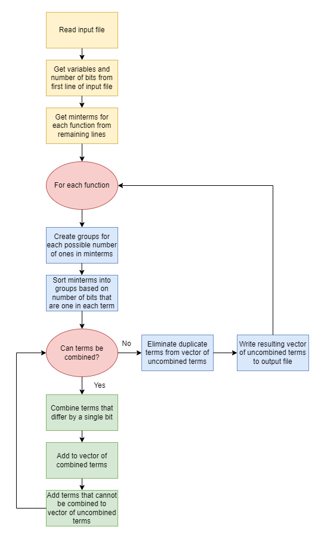

# quine-mccluskey

C++ implementation of the Quine-McCluskey algorithm

View the latest version of this code on [Github](https://github.com/delta-12/quine-mccluskey)

# Background

The Quine-McCluskey algorithm is used to minimize Boolean logic functions. If functions similar to Karnaugh maps, but compared to Karnaugh maps, the Quine-McCluskey algorithm is much easier work with when dealing with more than four variables, and it is also more efficient to implement on computers. The algorithm works by finding all prime implicants of a Boolean function, then from those, finding the essential prime implicants as well as the remaining implicants needed to cover the function. The time complexity of the algorithm increases exponentially with the number of variables. This C++ implementation of the Quine-McCluskey algorithm is meant to provide a more efficient means of determining the minimum SOP form of a Boolean expressions than calculating it by hand either using this algorithm or Karnaugh maps. It also allows users to easily work with functions with more than four variables. Some of the design goals of this implementation were readability and reuseability without sacrficing efficiency as this algorithm is already quite inefficient.

# Implementation

The following is the high-level steps the program performs.

1. Read in input file line-by-line
2. Get comma separated variables from the first line
3. Get number of variables from the first line which also determines number of bits for each function
4. Get the minterms for each function in SOP form from the remaining lines of the input file; Each line represents a set of minterms for a single function where the minterm numbers are listed as comma separated values
5. For each function or line of minterms
   1. Create groups for each possible number of bits that are one in a term
   2. Sort the minterms into groups correspoding to the number of ones present in each term
   3. Recursively run the alorithm to combine terms in adjacent groups (groups of terms that differ by one in the number of bits that are one present in each term) until the terms can no longer be combined
      1. Combine terms that differ by a single bit and add them to a vector of combined terms
      2. Terms that cannot be combined are added to vector of uncombined terms
      3. If any terms were added to the vector of combined terms, call the recursive algorithm to combine terms in adjacent groups on the vector of combined terms
   4. When terms are no longer added to the vector of combined terms, eliminate duplicate terms from remaining terms that can no longer be combined
   5. Write results to the output file

### Flow Chart



### Sample Input and Output

These are the contents of a sample input file of minterms for a 4-bit Gray code counter. Each of the four output bits is a function of five input bits represented by a, b, c, d, and e as indicated by the first line. The remaining line correspond the minterms of the four functions for the four output bits in SOP form.

```
a,b,c,d,e
1,2,5,6,9,10,13,14,17,18,21,22,25,26,29,30
2,3,4,5,10,11,12,13,18,19,20,21,26,27,28,29
4,5,6,7,8,9,10,11,20,21,22,23,24,25,26,27
8,9,10,11,12,13,14,15,16,17,18,19,20,21,21,22,23
```

These are the contents of the output file produced by the sample input above.

```
fxn_0(a,b,c,d,e) = de' + d'e
fxn_1(a,b,c,d,e) = cd' + c'd
fxn_2(a,b,c,d,e) = bc' + b'c
fxn_3(a,b,c,d,e) = ab' + a'b
```

# Test Results

Here is a test case calculated by hand compared with the result from the running program

### Calculations by hand

```
Minterms
-------------------------
n | a | b | c | e | f | f
-------------------------
1	0	0	0	0	0	1
6	0	0	0	1	1	0
12	0	0	1	1	0	0
14	0	0	1	1	1	0
16	0	1	0	0	0	0
20	0	1	0	1	0	0
26	0	1	1	0	1	0
31	0	1	1	1	1	1
34	1	0	0	0	1	0
38	1	0	0	1	1	0
42	1	0	1	0	1	0
46	1	0	1	1	1	0
50	1	1	0	0	1	0
56	1	1	1	0	0	0
57	1	1	1	0	0	1
63	1	1	1	1	1	1

Iteration 1
-----------------
(1)     000001
(16)	010000	✓
-----------------
(6)     000110	✓
(12)	001100	✓
(20)	010100	✓
(34)	100010	✓
-----------------
(14)	001110	✓
(26)	011010
(38)	100110	✓
(42)	101010	✓
(50)	110010	✓
(56)	111000	✓
-----------------
(46)	101110	✓
(57)	111001	✓
(31)	011111	✓
-----------------
(63)	111111	✓
-----------------


Iteration 2
-----------------
(16,20)	010X00
-----------------
(6,14)	00X110	✓
(6,38)	X00110	✓
(12,14)	0011X0
(34,38)	100X10	✓
(34,42)	10X010	✓
(34,50)	1X0010
-----------------
(14,46)	X01110	✓
(38,46)	10X110	✓
(42,46)	101X10	✓
(56,57)	11100X
-----------------
(31,63)	X11111
-----------------


Iteration 3
-----------------
(6,14,38,46)    X0X110
(34,38,42,46)   10XX10
-----------------

fxn(a,b,c,d,e,f) = a'b'c'd'e'f + a'bcd'ef' + a'b'cdf' + a'bc'e'f' + bcdef + ac'd'ef' + abcd'e' + b'def' + ab'ef'

```

### Program Calculations

Input

```
a,b,c,d,e,f
1,6,12,14,16,20,26,31,34,38,42,46,50,56,57,63
```

Output

```
fxn_0(a,b,c,d,e,f) = ab'ef' + b'def' + bcdef + abcd'e' + ac'd'ef' + a'b'cdf' + a'bc'e'f' + a'bcd'ef' + a'b'c'd'e'f
```

The program reads the input file line by line. From the first line, it determines it will display the output as functions of six variables a, b, c, d, e, and f. From the next line, the program reads in the minterms of the single function. It then creates six vectors, or groups, one for each number of bits that can be one in a term. It then counts the number of bits that are one in each term and assigns the term to a vector. For instance, terms 1 and 16 will be inserted into the first vector because they each have one bit that is one. The program then calls the recursive function to combine terms in adjacent groups. It compares terms in group one to those in group two, those in group two to those in group three, and so on. New groups of terms are created for those that can be combined. For instance, since terms 16 and 20 can be combined because they only differ by a single bit, they are placed into group 1X. The terms that are not combined are placed into another vector of uncombined terms. This includes terms 1 and 26. The recursive function to combine terms is then called on group of combined terms. Once terms can no longer combined after the third recursive function call, the program loops over the vector of uncombined terms to remove duplicates. In this case, there are no duplicates, so no terms need to be removed. The terms in this vector of uncombined terms are then output to a file where bits that are one are displayed as the letter corresponding to their position, bits that are zero are displayed as the letter corresponding to their position with a "'", and no letter is displayed for bits that would be represented by an "X" if doing the calculation by hand.

# TODO

- [ ] Replace class representing minterms with hashmaps to reduce time and spacial complexity, allows checking for duplicates to be reduced to O(n)
